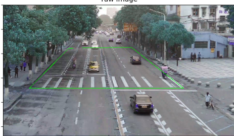
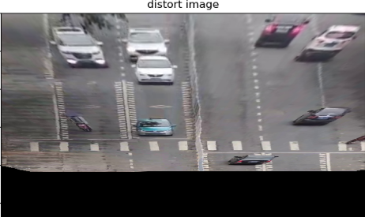
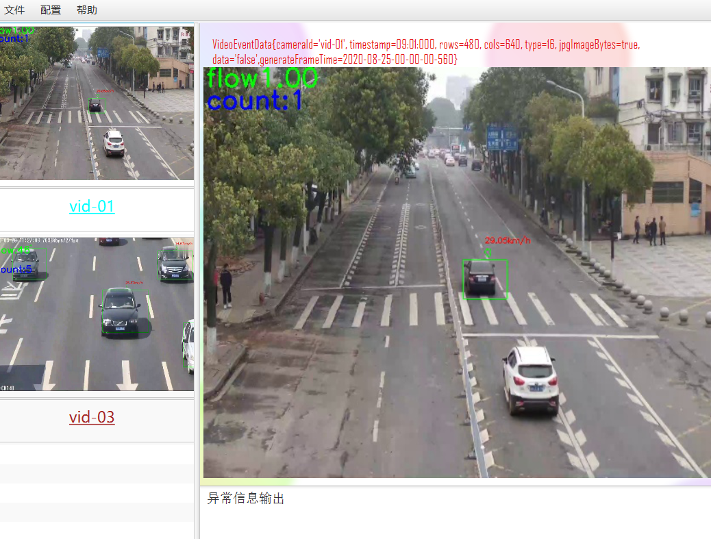

# Speed

## 功能

对多辆车进行跟踪，根据车辆的中心运动位置，对车辆的速度进行估计。

**速度为通过该区域的平均速度**

## 实现过程

###  跟踪阶段

1. 使用KCF算法进行跟踪，其中跟踪过程中对特定的车辆进行查找使用的是颜色特征，使用的是opencv的contribe算子，进行跟踪的函数为`public void update(Mat frame)`
2. 会对车辆的跟踪进行设置`trackers.get(i).setPhase(PHASE.TRACKER);`用于判断车辆是否可以进行速度估计
3. 如果跟踪算法不准确，车辆丢失，可以选择保留继续跟踪。所以增加函数`trackers.get(i).setMarkedDelete();`对丢失次数进行统计。本代码删除所以一次跟踪就丢失的车辆。
4. 删除跟踪的车辆超过了图片的边界`deleteOutFrame(frame.size());`,本代码值删除了超过x边界的车辆，有效的删除跟丢的物体。
5. 清理所有不在感兴趣范围的车辆，`trackers.deletedNotInArea(iot);`能够有效的去除边界的车辆
6. 在本代码中可以删除。`cleanLost(DEFAULT_LOST_TIME);`//清理丢失的目标，消失的帧数  时间 进行清理,只要发生丢失就进行清理

### 检测阶段


1. 使用yolo进行物体检测,返回结果可能为null,检测过程已经使用sychronize进行同步`List<Rect2d> dectedObjects = detector.detectObject(frame);`
2. 清理检测后的边框中超过边界的`void deleteCarsOutFrame(List<Rect2d> rect2ds,Size frameSize)`

3. 对同一目标进行位置更新和数字绑定`correctBounding(Mat frame, List<Rect2d> dectedObjects)`

   ​	(1) 对于判定为已经存在的对象，修改跟踪对象的位置

   ​		`trackers.updateTrackPos(frame,needAlterTrackerPos);`

   （2）对于新的对象，创建新的数字标签和位置

   ​		`createTrackerInList(frame,dectedObjects)`

4. 清理丢失的目标`cleanLost(DEFAULT_LOST_TIME);`
5. 对所有保存的trackerlist修改状态为`saveDetectorStat();`

### 速度计算 `SpeedCalculator`

1.获取速度值等

```java
//获取位置，速度  车辆长度
 SpeedCalculator speedCalculator = new SpeedCalculator(iot, trackers.getTrackers());
        //获取位置，速度  车辆长度
        ArrayList<Tuple3<Rect2d, Double,Double>> speedandpos = speedCalculator.calulateSpeed(time);
```

2.位置的保存

​	（1）previousPos：上一次10帧的位置

​	（2）nextPos最近的一次10帧的位置  =========》均发生在检测阶段

```java
//检测阶段，更新tracker时应该更新nextpos，最终会更新
saveDetectorStat();
for (int i = 0; i < trackers.size(); i++) {
            CarDes car = trackers.get(i);
            car.setPhase(PHASE.DETECTOR);
            car.setPreviousPos(car.getNetxPos());
            car.setNetxPos(car.getPos());
  }
```

​	(2)当前位置的保存pos，即每一帧的位置

​		 [1] 在检测阶段中，对已经存在的目标，会保存当前的位置

​		 [2] 检测阶段中，对于新创建的目标，保存当前位置[2020-8-17更新]

​		 [3] 在跟踪阶段时，会更新pos的位置

3. 速度计算

   ​	（1）带配置文件

   ​					1.根据配置文件对场景的固定区域进行透视变换

   ​							

   ​					2.透视变化的距离短

   ​							

   ​		  3.对透视变换的距范围硬编码指定距离 ，估计比例尺，计算距离

   ​							`IOTTransform` 实现距离计算

   ​	（2）不带配置文件 `NULLTransform`

   ​			1.根据车辆的宽度 和高度估计x 和y方向上的 比例

   ​			2.根据比例计算距离

### 图片输入

输入：任意

处理：根据配置文件进行定制

输出：自己指定 

#  输出效果

